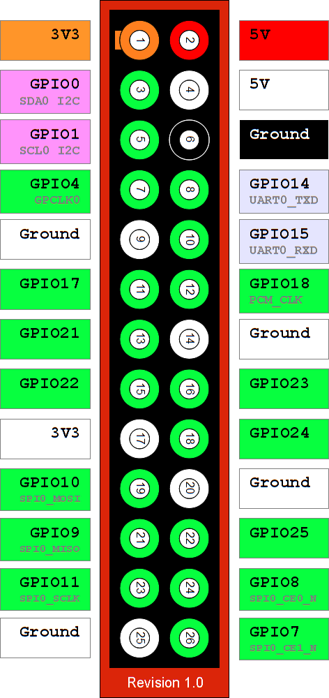
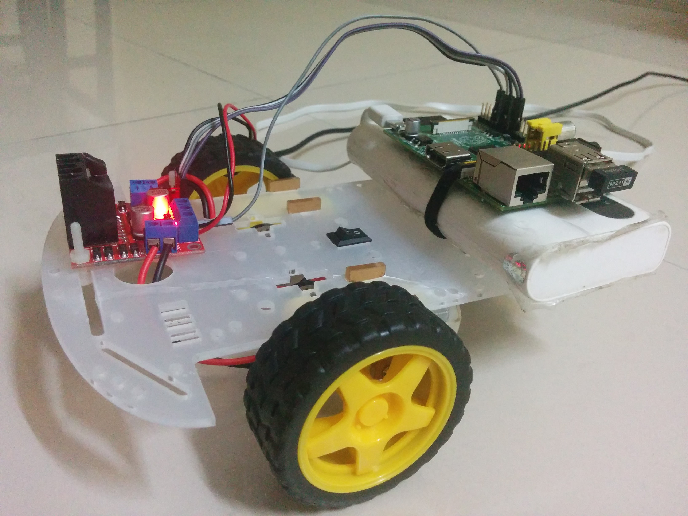
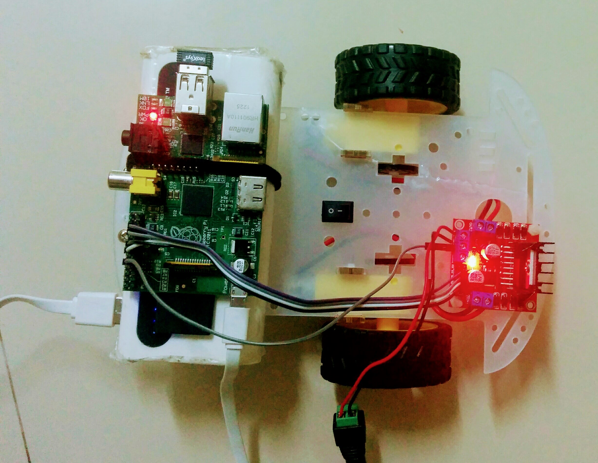
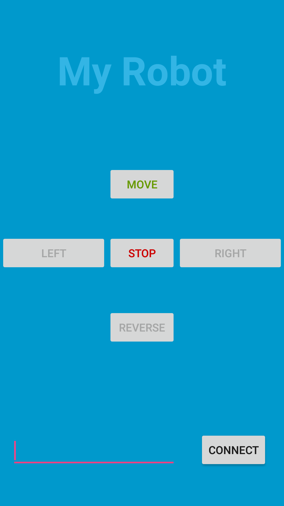

# l298n-controller-pi
L298N program for Raspberry Pi to controlling robot over internet

We will be running NodeJS application in Raspberry Pi to drive motor by getting control instructions over messaging protocol.
Messaging server could be running in Raspberry Pi or could be a dedicated server. There is an Android application which does control the rover movement for testing. But it could be extended with much larger use scenario. If you intend to do same, contact if I am available to help you.

## Interfaces
* We will be using wiring pi for interfacing raspberry Pi GPIOs
* Mosca implementation of messaging protocol
* NodeJS based messaging server will be running as daemon

## Pinouts
### RaspberryPi revision 1

We will be using four GPIO pins.

* GPIO21, GPIO22 for motor A
* GPIO9 and GPIO10 for motor B.

### L298N H-bridge
L298N is an H-bridge bidirectional motor driver.

* We are going to use motor A nad motor B interface pins. Will use jumper for motor A and so for motor B to make enable PWM.

## Robot hardware
Robot with complete hardware setup

# Android application
Compile android/TruckController application. Make sure to change broker IP address as you will be using.

## Conclusion

This project doesn't do much but shows automation over cloud. But the use case and scalablity is much larger.
