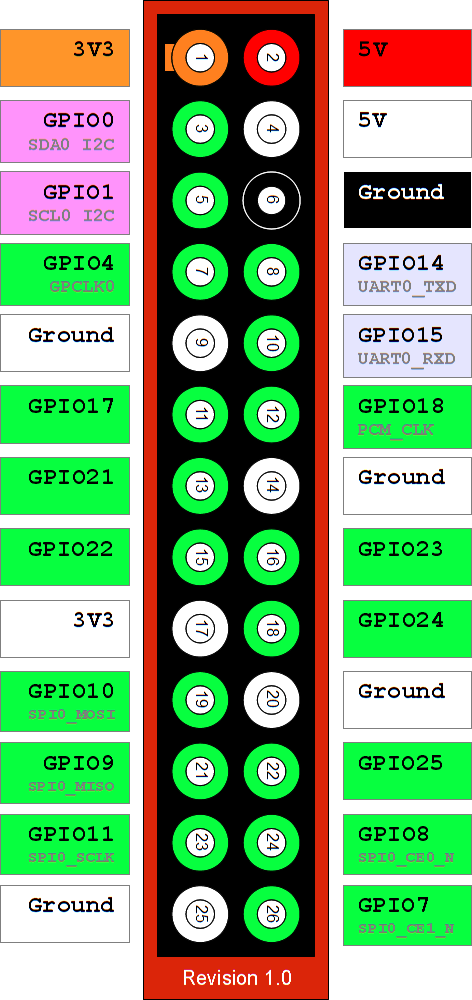
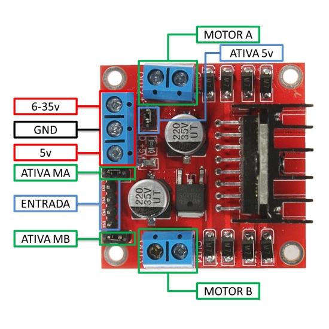

# l298n-controller-pi
L298N program for Raspberry Pi to controlling robot over internet

## Pinouts
### RaspberryPi revision 1

### L298N H-bridge
L298N is an H-bridge bidirectional motor driver.

